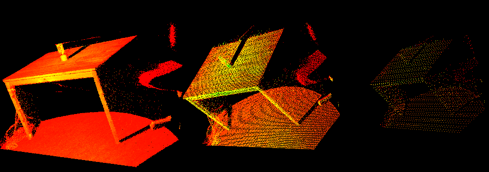

# PCL 代码 笔记

[TOC]

### 1.小点

#### 安装

`sudo apt-get install libpcl-dev pcl-tools`

#### 定义一个点云

 `pcl::PointCloud<pcl::PointXYZ>::Ptr cloud(new pcl::PointCloud<pcl::PointXYZ>);`，

#### 从PCD文件中读取点云

 `pcl::PCDReader reader; reader.read("table_scene_lms400.pcd",*cloud);`，

#### 保存点云

-  `pcl::io::savePCDFileASCII("test_pcd.pcd",cloud);`，

### 2. 小块

#### 轴向区间滤波

```c++
    pcl::PassThrough<pcl::PointXYZ> pass;
    pass.setInputCloud(cloud);
    pass.setFilterFieldName("z");
    pass.setFilterLimits(0,1);
//    pass.setNegative();
    pass.filter(*cloud_filtered);
```

#### 体素滤波
体素滤波，就是在一个规定大小的立方体内只最多选一个点，其他点全部过滤掉。
不知道为什么在一个电脑上可以运行另一个电脑就运行不了，reader一直报错。先学习吧，后面再看这个问题。
```c++
    pcl::PCLPointCloud2::Ptr cloud(new pcl::PCLPointCloud2); //注意用的点云格式
    pcl::PCLPointCloud2::Ptr cloud_filtered(new pcl::PCLPointCloud2);
    pcl::PCDReader reader;
    reader.read("/home/lt/CLionProjects/pcl_learning/cmake-build-debug/test_pcd.pcd",*cloud);
    cerr<<cloud->width<<" "<<cloud->height<<pcl::getFieldsList(*cloud)<<endl;

    std::cout<<"after"<<std::endl;
    //filter
    pcl::VoxelGrid<pcl::PCLPointCloud2> sor;
    sor.setInputCloud(cloud);
    sor.setLeafSize(0.01f,0.01f,0.01f);
    sor.filter(*cloud_filtered);
    pcl::PCDWriter writer;
    writer.write("table_sense_downsampled.pcd",*cloud_filtered,Eigen::Vector4f::Zero(),Eigen::Quaternionf::Identity(),
                 false);
```
 体素滤波前后的效果，分别设置体素大小为`0.01`和`0.05`
#### 去除外点 滤波
```
    pcl::StatisticalOutlierRemoval<pcl::PointXYZ> sor;
    sor.setInputCloud(cloud);
    sor.setMeanK(50); //每计算一个点根据他附近n个点来决定
    sor.setStddevMulThresh(1.0); // standard deviation multiplier (标准偏差乘子)to 1. 
    sor.filter(*cloud_filtered);
```
### 3 配准 registration


