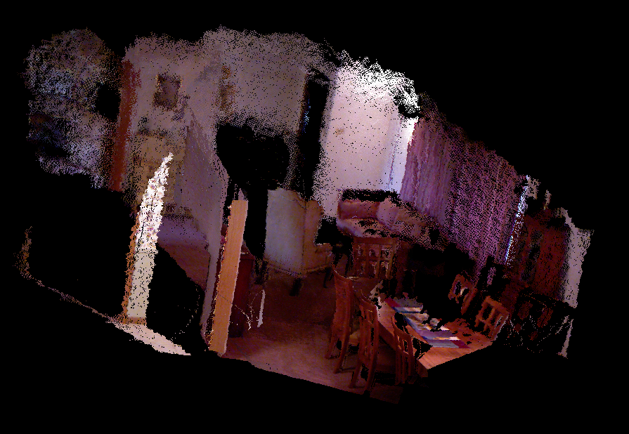
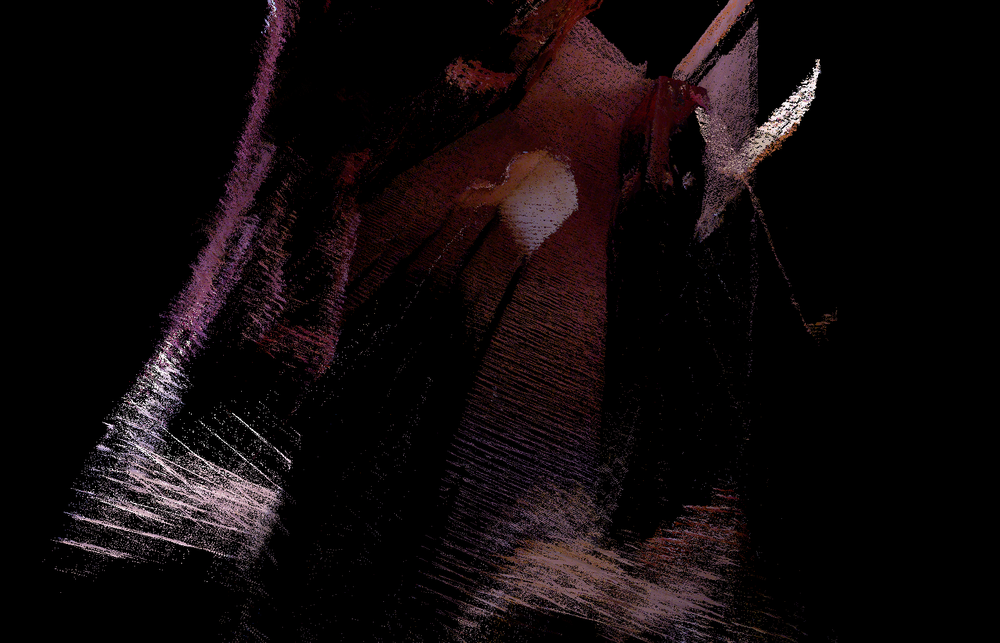
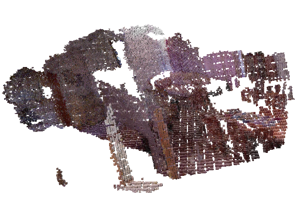

# PCL学习笔记
[TOC]

`PCL`教程学习包括以下几部分

- Basic Usage
- Advanced Usage
- Applications
- Features
- Filtering
- I/O
- Keypoints `关键点`
- KdTree `最近邻搜索算法` 
- Octree `八叉树`
- Range 
- Recognition `识别`
- Registration `配准` 把连续的几帧点云组合成一个一致性的点云
- Sample Consensus `RANSAC ` 
- Segmentation `分割`
- Surface `点云转曲面`
- Visualization `可视化`
- GPU

## 1. 先学习第一部分介绍吧
[教程链接](http://pointclouds.org/documentation/tutorials/)
`PCL`包括 

- 滤波:` 去除外点`

- 特征、关键点、匹配、分割等模块

  

## 2  [基础数据类型](http://pointclouds.org/documentation/tutorials/basic_structures.php#basic-structures)

PCL中最基本的数据类型就是`PointCloud`，它包括`width`, `height`,`points(std::vector<PointT>) ` `PointT` 是最基本的点的类型,

`is_dense`,`sensor_origin_`Sensor acquisition pose (origin/translation),`sensor_orientation`Sensor acquisition pose (rotation) 


## 3 代码笔记

### 1.小点

#### 安装

`sudo apt-get install libpcl-dev pcl-tools`

#### 定义一个点云

 `pcl::PointCloud<pcl::PointXYZ>::Ptr cloud(new pcl::PointCloud<pcl::PointXYZ>);`，

#### 从PCD文件中读取点云

 `pcl::PCDReader reader; reader.read("table_scene_lms400.pcd",*cloud);`，

#### 保存点云

- `pcl::io::savePCDFileASCII("test_pcd.pcd",cloud);`，

### 2. 小块

#### 引用 全能王

```shell
cmake_minimum_required(VERSION 2.8 FATAL_ERROR)
project(passthrough)
find_package(PCL 1.2 REQUIRED)

include_directories(${PCL_INCLUDE_DIRS})
link_directories(${PCL_LIBRARY_DIRS}) #所有的头文件
add_definitions(${PCL_DEFINITIONS})

add_executable (passthrough passthrough.cpp)
target_link_libraries (passthrough ${PCL_LIBRARIES}) #所有的库
```

#### 轴向区间滤波

```c++
    pcl::PassThrough<pcl::PointXYZ> pass;
    pass.setInputCloud(cloud);
    pass.setFilterFieldName("z");
    pass.setFilterLimits(0,1);
//    pass.setNegative();
    pass.filter(*cloud_filtered);
```

#### 体素滤波

体素滤波，就是在一个规定大小的立方体内只最多选一个点，其他点全部过滤掉。
不知道为什么在一个电脑上可以运行另一个电脑就运行不了，reader一直报错。先学习吧，后面再看这个问题。

```c++
    pcl::PCLPointCloud2::Ptr cloud(new pcl::PCLPointCloud2); //注意用的点云格式
    pcl::PCLPointCloud2::Ptr cloud_filtered(new pcl::PCLPointCloud2);
    pcl::PCDReader reader;
    reader.read("/home/lt/CLionProjects/pcl_learning/cmake-build-debug/test_pcd.pcd",*cloud);
    cerr<<cloud->width<<" "<<cloud->height<<pcl::getFieldsList(*cloud)<<endl;

    std::cout<<"after"<<std::endl;
    //filter
    pcl::VoxelGrid<pcl::PCLPointCloud2> sor;
    sor.setInputCloud(cloud);
    sor.setLeafSize(0.01f,0.01f,0.01f);
    sor.filter(*cloud_filtered);
    pcl::PCDWriter writer;
    writer.write("table_sense_downsampled.pcd",*cloud_filtered,Eigen::Vector4f::Zero(),Eigen::Quaternionf::Identity(),
                 false);
```

 体素滤波前后的效果，分别设置体素大小为`0.01`和`0.05`

#### 静外点去除滤波

去除外点滤波还是很有用的，空间中的杂点对

```
    pcl::StatisticalOutlierRemoval<pcl::PointXYZ> sor;
    sor.setInputCloud(cloud);
    sor.setMeanK(50); //每计算一个点根据他附近n个点来决定
    sor.setStddevMulThresh(1.0); // standard deviation multiplier (标准偏差乘子)to 1. 
    sor.filter(*cloud_filtered);
```

### 3 配准 registration

pcl中的配准算法有`ICP` ，`NDT`
[短短几句话，说出了环境重建的核心，好文章](http://pointclouds.org/documentation/tutorials/registration_api.php#registration-api)

**程序示例**

```c++
#include <iostream>
#include <pcl/io/pcd_io.h>
#include <pcl/point_types.h>
#include <pcl/registration/icp.h>
using namespace std;
int  main(int argc,char** argv){
    pcl::PointCloud<pcl::PointXYZ>::Ptr pointCloud1(new pcl::PointCloud<pcl::PointXYZ>);
    pcl::PointCloud<pcl::PointXYZ>::Ptr pointCloud2(new pcl::PointCloud<pcl::PointXYZ>);
    pcl::PCDReader reader;
    reader.read("sample.pcd",*pointCloud1);
    *pointCloud2=*pointCloud1;
    for (int i = 0; i < pointCloud2->points.size(); ++i) {
        pointCloud2->points[i].x+=0.3;
        pointCloud2->points[i].y-=0.2;
    }
    pcl::IterativeClosestPoint<pcl::PointXYZ,pcl::PointXYZ> icp;
    icp.setInputSource(pointCloud1);
    icp.setInputTarget(pointCloud2);
    pcl::PointCloud<pcl::PointXYZ> final;
    icp.align(final);
    std::cout << "has converged:" << icp.hasConverged() << " score: " <<
              icp.getFitnessScore() << std::endl;
    std::cout<<icp.getFitnessScore()<<" "<<endl;
    std::cout<<icp.getFinalTransformation()<<" "<<endl;
    return 0;
}
```

需要注意的几点：
ICP中电云的定义必须要是`    pcl::PointCloud<pcl::PointXYZ>::Ptr pointCloud1(new pcl::PointCloud<pcl::PointXYZ>);`这样子的，指针型

### 4 已知位姿的多帧深度图拼接

主要流程：读取深度图和彩色图，读取相机轨迹位姿，拼接，

主要代码：

```c++
    typedef pcl::PointXYZRGB PointT;
    typedef pcl::PointCloud<PointT> PointCloud;
    PointCloud::Ptr pointcloud(new PointCloud);
    for (int i = 0; i < 5; ++i) {
        cout<<boost::format("正在转换第%1%张\n")%i;
        cv::Mat color=colorImgs[i];
        cv::Mat depth=depthImgs[i];
        Eigen::Isometry3d T=poses[i];
        for (int v = 0; v < color.rows; ++v) {
            for (int u = 0; u < color.cols; ++u) {
                unsigned int d  =depth.ptr<unsigned short >(v)[u];
                if(d==0){
                    continue;
                }
                Eigen::Vector3d point;
                point[2]=double(d)/depthScale;
                point[0]=(u-cx)*point[2]/fx; //相机参数投影彩色点
                point[1]=(v-cy)*point[2]/fy;
                Eigen::Vector3d pointWorld=T*point;
                PointT p;
                p.x=pointWorld[0];p.y=pointWorld[1];p.z=pointWorld[2];
                p.b=color.data[v*color.step+u*color.channels()];
                p.g=color.data[v*color.step+u*color.channels()+1];
                p.r=color.data[v*color.step+u*color.channels()+2];
                pointcloud->points.push_back(p);
            }
        }
    }
    pointcloud->is_dense=false;
```

实验效果：



但是局部显示重影严重，试着用**体素滤波**下；



用过`staticOutlierRemoval`算法后小姑果然非常好



### 5 点云格式转换

> **1.pcl::fromPCLPointCloud2()**  
>
> **2.pcl::toPCLPointCloud2()**


- `pcl::pointcloud2`二进制数据blob到`PCL::PointCloud<pointT>`

```
void pcl::fromPCLPointCloud(const pcl:PCLPointCloud2 & msg                                                   pcl::PointCloud<PointT>  & cloud                                                     const MsgFieldMap & filed_map)
```

函数使用field_map实现将一个pcl::pointcloud2二进制数据blob到PCL::PointCloud<pointT>对象

- `pcl::toPCLPointCloud2(*cloud_filtered, *cloud_filtered_blob[]);`，
- ` void pcl::fromROSMsg（const pcl:PCLPointCloud2 & msg，::PointCloud<PointT>  & cloud）` 和ros消息互相转换


### 6 平面模型分割

```c++
  pcl::ModelCoefficients::Ptr coefficients (new pcl::ModelCoefficients);
  pcl::PointIndices::Ptr inliers (new pcl::PointIndices);
  // Create the segmentation object
  pcl::SACSegmentation<pcl::PointXYZ> seg;
  // Optional
  seg.setOptimizeCoefficients (true);
  // 参数
  seg.setModelType (pcl::SACMODEL_PLANE);
  seg.setMethodType (pcl::SAC_RANSAC);
  seg.setDistanceThreshold (0.01);

  seg.setInputCloud (cloud);
  seg.segment (*inliers, *coefficients);
```


### 7 分割并提取点云索引 [link](http://pointclouds.org/documentation/tutorials/extract_indices.php#extract-indices)

通过平面分割算法提取出索引，散后使用`Extract index filter`去滤波。

