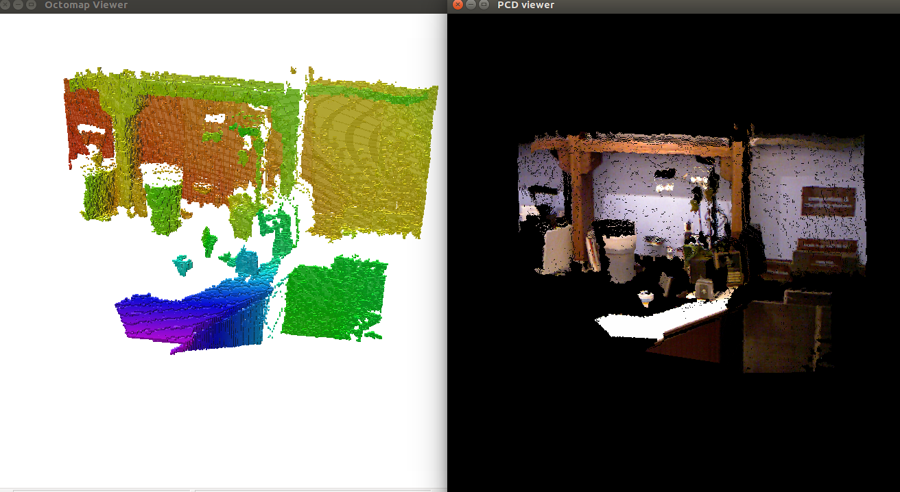
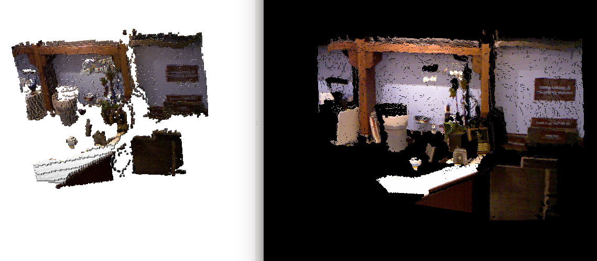

# Octo map 笔记
[TOC]
###1.安装

```
sudo apt-get install ros-kinetic-octomap #库
sudo apt-get install ros-kinetic-octovis #可视化
```
可以用这几个示例数据集测试 `https://github.com/OctoMap/octomap/tree/devel/octomap/share`
###2.测试
示例数据集测试 `https://github.com/OctoMap/octomap/tree/devel/octomap/share`
大型数据集： `http://ais.informatik.uni-freiburg.de/projects/datasets/octomap/`
用法：`octovis ~/data/octomap_data/freiburg1_360.bt`
###3.程序使用
####  头文件引入
```
# - octomap
FIND_PACKAGE( octomap REQUIRED )
INCLUDE_DIRECTORIES( ${OCTOMAP_INCLUDE_DIRS} )
```
#### - [octo tree 创建](https://www.cnblogs.com/gaoxiang12/p/5041142.html)
```c
    octomap::OcTree tree(0.01);
    for (int i = 0; i < cloud.points.size(); ++i) {
        tree.updateNode(octomap::point3d(cloud.points[i].x,cloud.points[i].y,cloud.points[i].z), true); //true表示这个点是占据点，false 空闲点
    }
    tree.updateInnerOccupancy();
    tree.writeBinary(output_file);  //写成二进制文件
```

#### - 也可以转换成彩色的octo map
~~~c
	#include <octomap/ColorOcTree.h> // 头文件添加
	
 octomap::ColorOcTree tree(0.01);  //tree 的类型变了
    for (int i = 0; i < cloud.points.size(); ++i) {
        tree.updateNode(octomap::point3d(cloud.points[i].x,cloud.points[i].y,cloud.points[i].z), true); //true表示这个点是占据点，false 空闲点
    }
    // 在这里赋予颜色信息
    for (int i = 0; i < cloud.points.size(); ++i) {
        tree.integrateNodeColor(cloud.points[i].x,cloud.points[i].y,cloud.points[i].z ,cloud.points[i].r,cloud.points[i].g,cloud.points[i].b); 
    }
    tree.updateInnerOccupancy();
    tree.write(output_file); //输出文件改成 .ot格式
~~~
最后效果：
 

#### - 用octo map 来构图

    