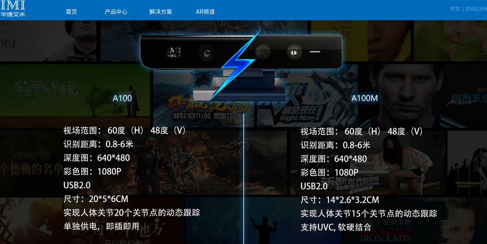

# 深度相机选型

### 1. [华捷艾米](http://www.hjimi.com/?pro/tgsb/)

特点：`USB2.0` 淘宝：`¥799.00 `

### 2. 小觅双目立体相机

`USB3.0`， `￥1999`

官网链接： https://www.myntai.com/cn/camera/camera_specs

教程链接：https://github.com/slightech/MYNT-EYE-SDK

多个SLAM框架实例：

- [MYNT-EYE-OKVIS-Sample](https://github.com/slightech/MYNT-EYE-OKVIS-Sample)
- [MYNT-EYE-ORB-SLAM2-Sample](https://github.com/slightech/MYNT-EYE-ORB-SLAM2-Sample)
- [MYNT-EYE-VINS-Sample](https://github.com/slightech/MYNT-EYE-VINS-Sample)
- [MYNT-EYE-VIORB-Sample](https://github.com/slightech/MYNT-EYE-VIORB-Sample)

### 3. 图漾 立体相机

淘宝链接：https://shop564213940.taobao.com/

| 型号             | DM430                                                        | DM460                                                        | DM460-C                                                      | DS460                                                        |
| ---------------- | ------------------------------------------------------------ | ------------------------------------------------------------ | ------------------------------------------------------------ | ------------------------------------------------------------ |
| 购买链接         | [订购](https://item.taobao.com/item.htm?spm=a1z38n.10677092.0.0.7961f75ajzeyT1&id=543877091580&abbucket=13) | [订购](https://item.taobao.com/item.htm?spm=2013.1.0.0.53d3ab67UoLZba&id=543852033046&scm=1007.12144.81309.42296_42296&pvid=9307f62a-9d0a-4b25-9b40-c4465f43e796&idnum=0) | 邮件至 info@percipio.xyz 或联系[图漾科技淘宝店](https://shop564213940.taobao.com/) | 邮件至 info@percipio.xyz 或联系[图漾科技淘宝店](https://shop564213940.taobao.com/) |
| 尺寸-W/H/D（mm） | 90 x 23 x 31.6                                               | 90 x 23 x 31.6                                               | 90 x 23 x 31.6                                               | 90 x 23 x 31.6                                               |
| 工作距离         | 0.5 - 6                                                      | 0.5 - 6                                                      | 0.5 - 6                                                      | 0.24-3.5                                                     |
| Depth FOV（H/V） | 56° / 46°                                                    | 56° / 46°                                                    | 56° / 46°                                                    | 60° / 48°                                                    |
| RGB FOV（H/V）   | -                                                            | -                                                            | 56° / 46°                                                    | -                                                            |
| RGB-D 同步       | -                                                            | -                                                            | 不同步                                                       | -                                                            |
| RGB-D 对齐       | -                                                            | -                                                            | 不同步                                                       | -                                                            |
| 深度分辨率       | VGA                                                          | VGA                                                          | VGA                                                          | VGA                                                          |
| 深度帧率（fps）  | 15                                                           | 30                                                           | 30                                                           | 30                                                           |
| RGB分辨率        | -                                                            | -                                                            | VGA                                                          | -                                                            |
| RGB帧率          | -                                                            | -                                                            | 30                                                           | -                                                            |
| 触发控制         | 支持                                                         | 支持                                                         | 支持                                                         | 支持                                                         |
| 接口             | USB 2.0                                                      | USB 2.0                                                      | USB 2.0 x 2                                                  | USB 2.0                                                      |
| 室外适用         | 仅室内                                                       | 仅室内                                                       | 仅室内                                                       | 仅室内                                                       |

【深度参数】
 VGA: 该等级有效分辨率为 560 x 460。 HD: 该等级的有效分辨率为1120 x 920。 FHD: 该等级的有效分辨率为1920 x 1080。 

### 4 奥比中光3D摄像头

`usb2.0` `￥1000`

淘宝： https://item.taobao.com/item.htm?spm=a230r.1.14.1.1248690cErtAoo&id=565045747664&ns=1&abbucket=7#detail

